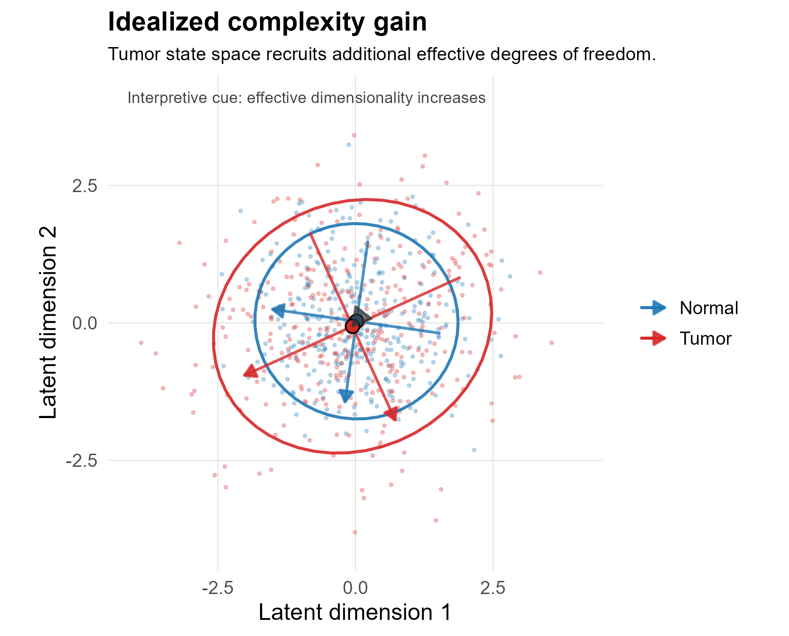
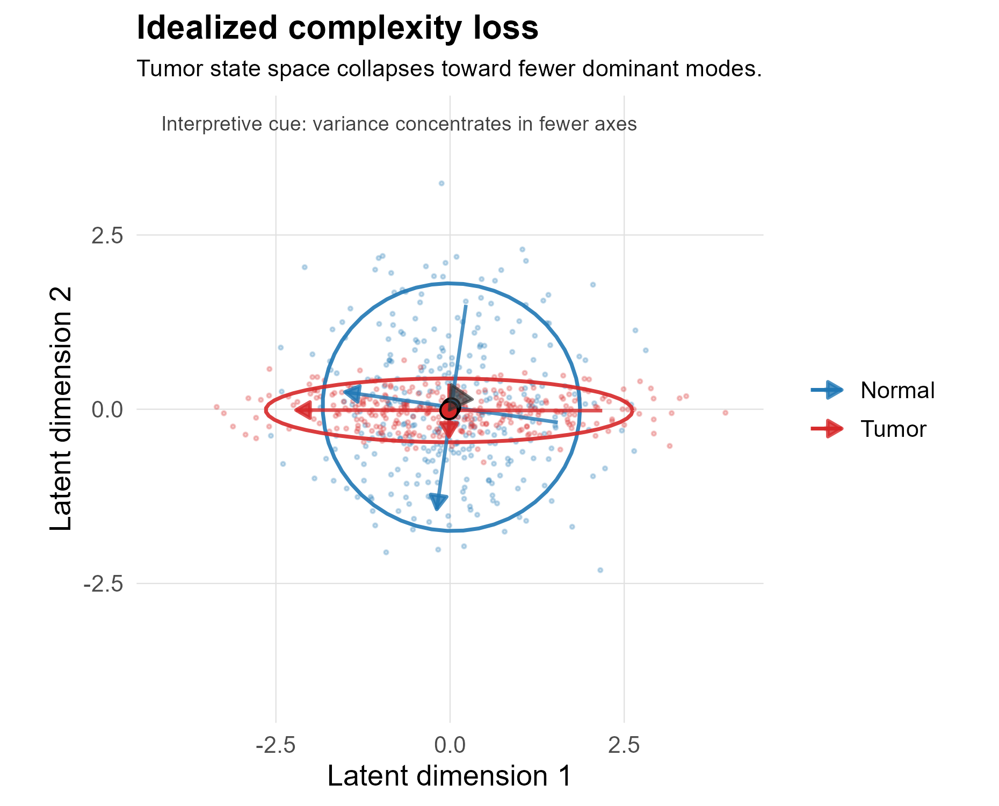
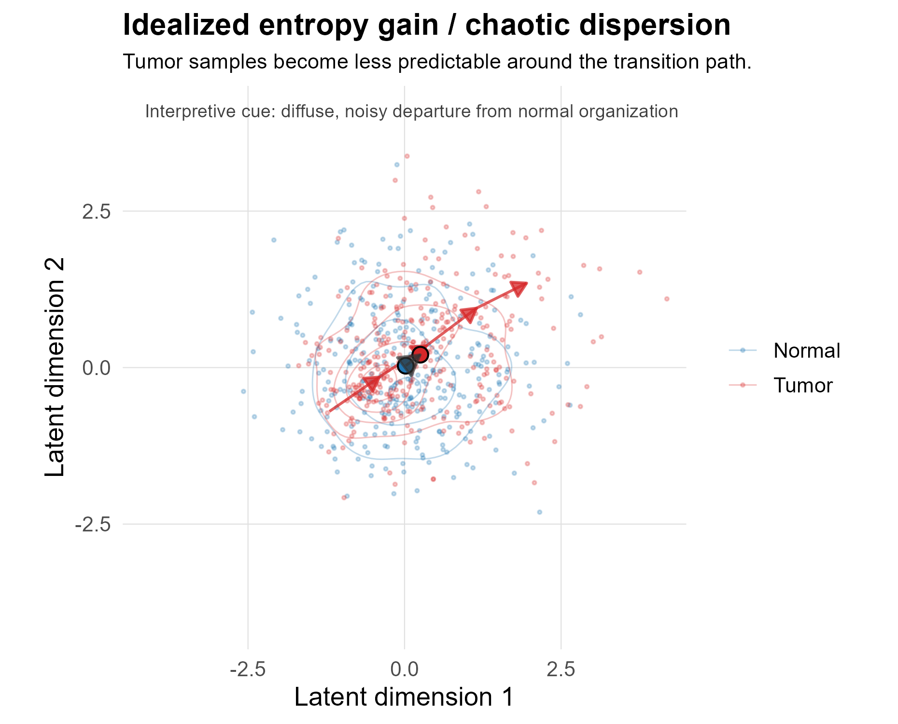
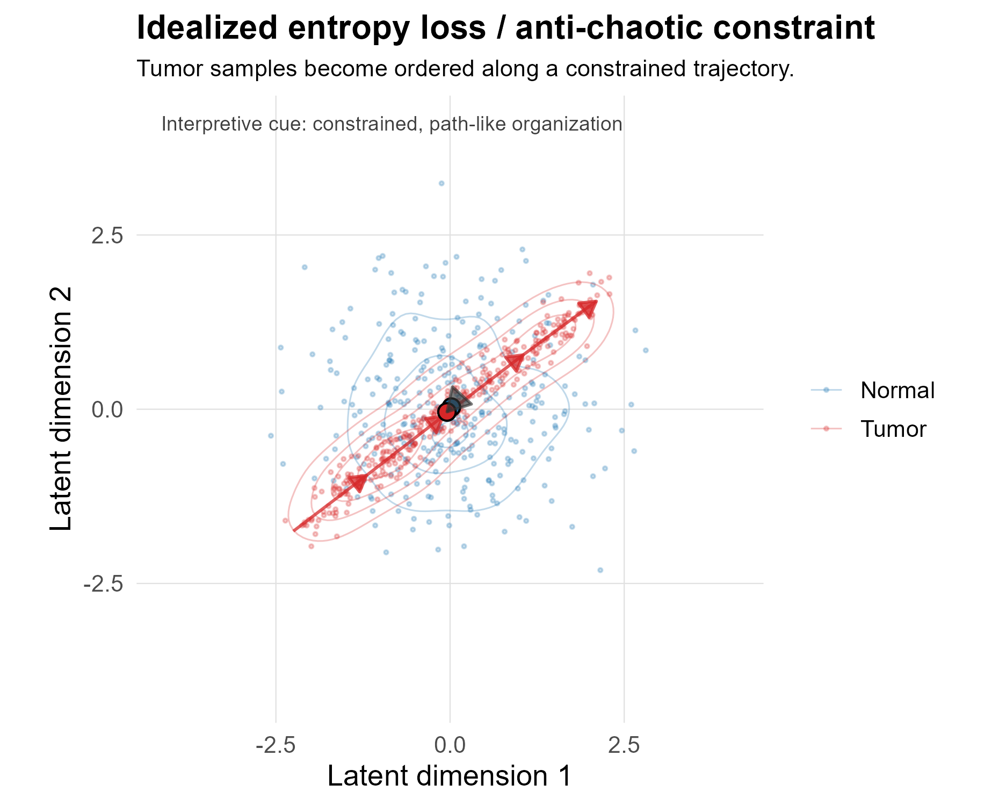

This chapter defines the statistical measures used to describe changes in transcriptomic organization during the transition from normal tissue to tumor. The goal is not to assign a single universal meaning to *complexity* or *entropy*, but to use a small family of matrix- and spectrum-based observables that describe complementary aspects of biological state-space structure.

The central object is an expression matrix, denoted here as

$$
X \in \mathbb{R}^{p \times n},
$$

where rows represent probes or genes and columns represent samples. For each tissue-specific comparison, normal and tumor samples are analyzed separately and then compared through a change statistic:

$$
\Delta M = M_{tumor} - M_{normal}.
$$

Positive and negative values of \(\Delta M\) are interpreted relative to the specific metric being considered. For example, a positive change in effective rank implies a more distributed eigenvalue spectrum, whereas a positive change in condition number implies greater anisotropy or dominance by a small number of directions.

::: {.callout-note}
These measures are structural summaries of expression data. They should not be interpreted as direct dynamical measures of cancer unless supported by time-series, lineage, perturbation, or trajectory data.
:::

---

## Visual Interpretation Framework

The figures below are idealized schematics. They are included to clarify the vocabulary used throughout the analysis. They are not empirical results from the cancer dataset.

```{r}
#| label: fig-idealized-complexity-gain
#| echo: false
#| fig-cap: "Idealized complexity gain: tumor samples occupy a broader, higher-dimensional state space."

```

```{r}
#| label: fig-idealized-complexity-loss
#| echo: false
#| fig-cap: "Idealized complexity loss: tumor samples collapse toward a lower-dimensional structure."

```

```{r}
#| label: fig-idealized-entropy-gain
#| echo: false
#| fig-cap: "Idealized entropy gain: tumor samples become more diffuse and less predictable."

```

```{r}
#| label: fig-idealized-entropy-loss
#| echo: false
#| fig-cap: "Idealized entropy loss: tumor samples become more concentrated and ordered."

```

These schematics establish the qualitative vocabulary used later in the report:

| Pattern | Structural interpretation | Expected metric tendency |
|:---|:---|:---|
| **Complexity gain** | More effective axes of variation are active | $\Delta$ effective rank $> 0$; $\Delta$ participation ratio $> 0$ |
| **Complexity loss** | Variation collapses toward fewer dominant axes | $\Delta$ effective rank $< 0$; $\Delta$ participation ratio $< 0$ |
| **Entropy gain** | Variance or expression mass becomes more diffuse | $\Delta$ Shannon entropy $> 0$ and/or $\Delta$ spectral entropy $> 0$ |
| **Entropy loss** | Variation becomes more concentrated or predictable | $\Delta$ Shannon entropy $< 0$ and/or $\Delta$ spectral entropy $< 0$ |
| **Increased anisotropy** | One or a few directions dominate the system | $\Delta$ condition number $> 0$; $\Delta$ leading-eigenvalue fraction $> 0$ |
| **Decreased anisotropy** | Variance becomes more evenly distributed across directions | $\Delta$ condition number $< 0$; $\Delta$ leading-eigenvalue fraction $< 0$ |

---

## Complexity Measures

### Conceptual Definition

In this pipeline, complexity refers to the geometry and effective dimensionality of the expression matrix. Complexity is not treated as a single scalar property. Instead, it is represented through several related summaries of the covariance or singular-value structure of the data.

The main statistical question is whether tumor samples occupy expression space differently from matched normal samples. This may occur through expansion into additional dimensions, collapse onto fewer axes, or increased dominance of one major direction of variation.

### Covariance and Spectrum

For each group, the sample covariance matrix is estimated from the expression matrix after preprocessing and filtering:

$$
\Sigma = \mathrm{cov}(X).
$$

Let the eigenvalues of $\Sigma$ be

$$
\lambda_1 \geq \lambda_2 \geq \cdots \geq \lambda_d \geq 0.
$$

The eigenvalue spectrum describes how variance is distributed across latent or expression-space directions. A spectrum dominated by $\lambda_1$ indicates anisotropy. A more evenly distributed spectrum indicates higher effective dimensionality.

### Implemented Complexity Metrics

| Metric | Definition | What it measures | Interpretation in this framework |
|:---|:---|:---|:---|
| **Covariance condition number** | $\kappa(\Sigma) = \lambda_{max}/\lambda_{min}$ | Numerical and geometric anisotropy | High values indicate that variance is concentrated along a small number of directions. |
| **SVD condition number** | $\kappa(X) = \sigma_{max}/\sigma_{min}$ | Singular-value imbalance | Supports interpretation of matrix elongation or low-dimensional dominance. |
| **Effective rank** | $\exp(-\sum_i p_i \log p_i)$, where $p_i = \lambda_i / \sum_j \lambda_j$ | Entropy-based dimensionality | Higher values indicate that variance is distributed across more effective dimensions. |
| **Participation ratio** | $(\sum_i \lambda_i)^2 / \sum_i \lambda_i^2$ | Effective number of contributing dimensions | Higher values indicate broader participation of multiple variance directions. |
| **Leading-eigenvalue fraction** | $\lambda_1 / \sum_i \lambda_i$ | Dominance of the first principal axis | Higher values indicate stronger anisotropy and possible collapse toward a dominant mode. |
| **Matrix sparsity** | Proportion of near-zero entries | Magnitude distribution | Descriptive only; biological interpretation is limited after microarray normalization. |

::: {.callout-warning}
A high condition number should not be described as biological instability by itself. In this setting, it primarily indicates anisotropy, numerical ill-conditioning, or dominance by a small number of covariance directions.
:::

### Complexity Gain and Complexity Loss

A complexity gain is inferred when tumor samples show increased effective dimensionality relative to normal tissue. This is most defensible when effective rank and/or participation ratio increase.

A complexity loss is inferred when tumor samples show reduced effective dimensionality. This is most defensible when effective rank and/or participation ratio decrease, especially if accompanied by increased leading-eigenvalue dominance.

These patterns are not automatically good or bad biologically. A complexity gain may reflect true diversification of tumor states, increased cell-state heterogeneity, stromal admixture, or technical heterogeneity. A complexity loss may reflect clonal selection, canalization, transcriptional convergence, or filtering artifacts. Interpretation therefore requires connection to tissue context, filtering strategy, and enriched biological processes.

---

## Entropy Measures

### Conceptual Definition

Entropy measures quantify uncertainty, dispersion, or evenness. In this analysis, entropy is used in two related but distinct senses:

1. **Expression-distribution entropy**, which summarizes uncertainty in expression values or discretized expression distributions.
2. **Spectral entropy**, which summarizes evenness of the covariance eigenvalue spectrum.

These two quantities need not agree. A tumor comparison may show increased expression-level disorder but decreased spectral dimensionality, or vice versa.

### Implemented Entropy Metrics

| Metric | Definition | What it measures | Interpretation in this framework |
|:---|:---|:---|:---|
| **Shannon entropy** | $H = -\sum_i p_i \log p_i$ | Distributional uncertainty | Higher values indicate greater spread or uncertainty in the chosen distribution. |
| **Spectral entropy** | $H_{spec} = -\sum_i p_i \log p_i$, where $p_i = \lambda_i / \sum_j \lambda_j$ | Evenness of variance distribution across dimensions | Higher values indicate a more even eigenvalue spectrum. |
| **Eigenvalue entropy delta** | $H_{tumor} - H_{normal}$ | Change in spectral evenness | Positive values suggest broader variance distribution; negative values suggest spectral concentration. |
| **Directional entropy label** | Thresholded entropy change | Qualitative direction of change | Heuristic interpretive label, not an independent statistical test. |

### Entropy Gain and Entropy Loss

Entropy gain indicates that tumor samples show greater uncertainty, dispersion, or spectral evenness than matched normal samples. In the language of this project, this can support a cautious interpretation of increased disorder or chaotic tendency.

Entropy loss indicates that tumor samples become more concentrated, predictable, or spectrally ordered. In the language of this project, this can support a cautious interpretation of anti-chaotic tendency or increased constraint.

::: {.callout-important}
Terms such as “chaotic” and “anti-chaotic” are interpretive labels for entropy direction. They do not imply that the data reconstruct a dynamical strange attractor or that Lyapunov exponents have been estimated.
:::

---

## Statistical Inference

### Change Statistics

For every metric \(M\), the primary descriptive quantity is the normal-to-tumor change:

$$
\Delta M = M_{tumor} - M_{normal}.
$$

This direction convention is used consistently throughout the pipeline. Positive values indicate that the metric is larger in tumor than in normal tissue; negative values indicate that the metric is smaller in tumor than in normal tissue.

### Permutation Testing

Permutation testing is the primary inferential procedure. Group labels are randomly reassigned while preserving the observed expression matrix. The observed statistic is compared against the null distribution generated by repeated label permutations.

For a two-sided test, the empirical p-value is computed as:

$$
p_{perm} = \frac{1 + \sum_{b=1}^{B} I(|\Delta M_b| \geq |\Delta M_{obs}|)}{B + 1}.
$$

This procedure asks whether the observed normal-tumor difference is larger than expected under random assignment of samples to groups.

### Distributional Tests

Distributional comparisons are used as secondary diagnostics.

| Statistic | Method | What it evaluates | Role in this pipeline |
|:---|:---|:---|:---|
| **$p_{perm}$** | Permutation test | Whether the observed group difference exceeds random label assignment | Primary inferential statistic |
| **$p_{wilcox}$** | Wilcoxon rank-sum test | Shift in rank distributions | Secondary descriptive test |
| **$p_{ks}$** | Kolmogorov-Smirnov test | Difference in distribution shape, location, or spread | Exploratory diagnostic |
| **Bootstrap CI** | Resampling within groups | Stability of estimated metric | Uncertainty summary |

### Multiple Testing

Because metrics are evaluated across many tissue-tumor comparisons and biological feature sets, p-values should be interpreted with multiplicity in mind. Where formal claims are made across many tests, false-discovery-rate adjustment should be reported. Unadjusted p-values are best treated as screening or descriptive evidence.

---

## Joint Interpretation of Complexity and Entropy

Complexity and entropy are related but not interchangeable. Effective dimensionality can increase while expression entropy decreases, and entropy can increase without a meaningful gain in structured complexity.

A useful interpretive grid is:

| Complexity direction | Entropy direction | Possible interpretation | Caution |
|---|---|---|---|
| Gain | Gain | Dysregulated expansion: more dimensions and greater disorder | Could reflect biological heterogeneity or technical/sample mixture. |
| Gain | Loss | Ordered expansion: more dimensions but more constrained organization | Requires pathway-level support before biological interpretation. |
| Loss | Gain | Disorganized collapse: fewer effective axes but greater local disorder | May indicate noisy expression around a reduced structure. |
| Loss | Loss | Functional constraint or canalization: fewer dimensions and lower uncertainty | Could reflect clonal selection, tissue purity, or filtering effects. |

This grid is used as an interpretive scaffold, not as an automatic classifier. Final biological interpretation should integrate the metric pattern with GO/KEGG enrichment, tissue context, sample size, and filtering strategy.

---

## Practical Interpretation Rules

The following rules guide conservative interpretation:

1. Treat agreement among effective rank, participation ratio, and spectral entropy as stronger evidence than any single metric.
2. Treat condition number and leading-eigenvalue fraction as measures of anisotropy, not standalone measures of biological complexity.
3. Distinguish expansion/contraction of sample clouds from dimensionality gain/loss. A cloud can expand isotropically without becoming more structurally complex.
4. Use “chaotic” and “anti-chaotic” only as shorthand for entropy direction unless true dynamical data are available.
5. Interpret all biological claims in relation to enriched pathways, tissue identity, and sample composition.

---

## Summary

This framework treats malignant transformation as a change in transcriptomic state-space organization. Complexity metrics describe dimensionality, anisotropy, and spectral structure. Entropy metrics describe uncertainty, dispersion, and spectral evenness. Joint interpretation of these quantities provides a structured way to distinguish expansion, contraction, constraint, and disorder in normal-to-tumor comparisons.

The resulting framework is intentionally pluralistic: no single scalar value defines cancer complexity. Instead, biological interpretation emerges from concordance or discordance among multiple structural measures, supported by pathway-level evidence and conservative statistical inference.
