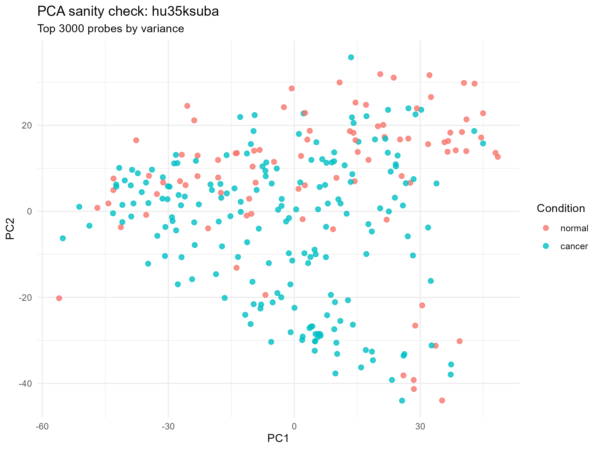
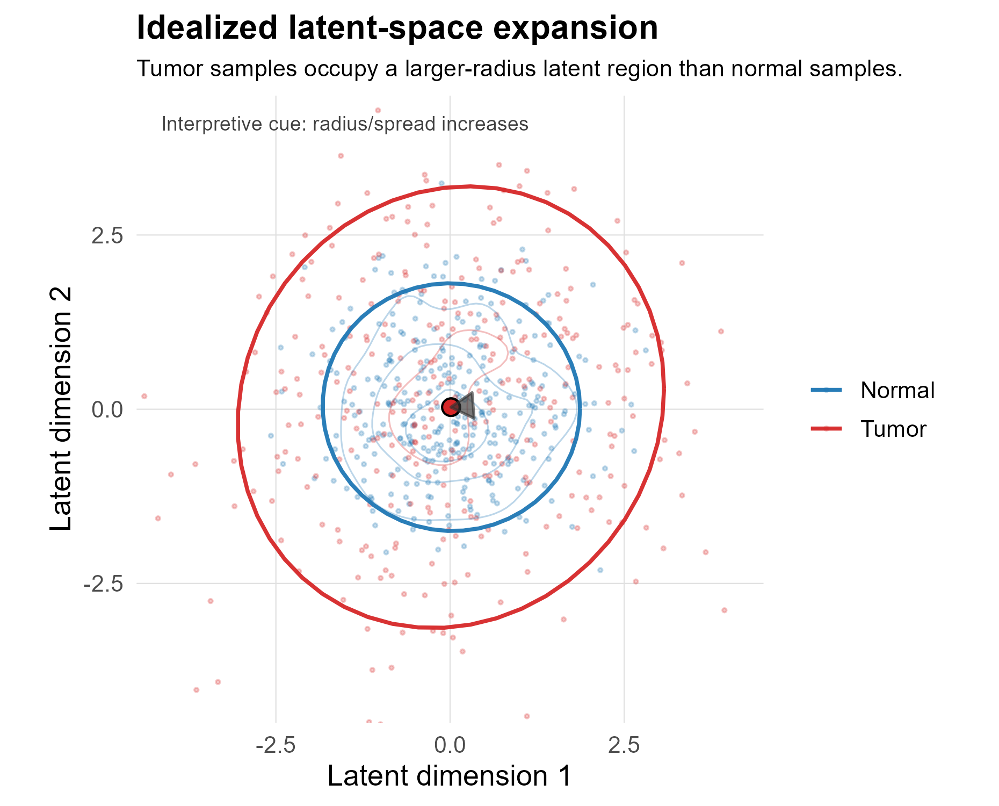
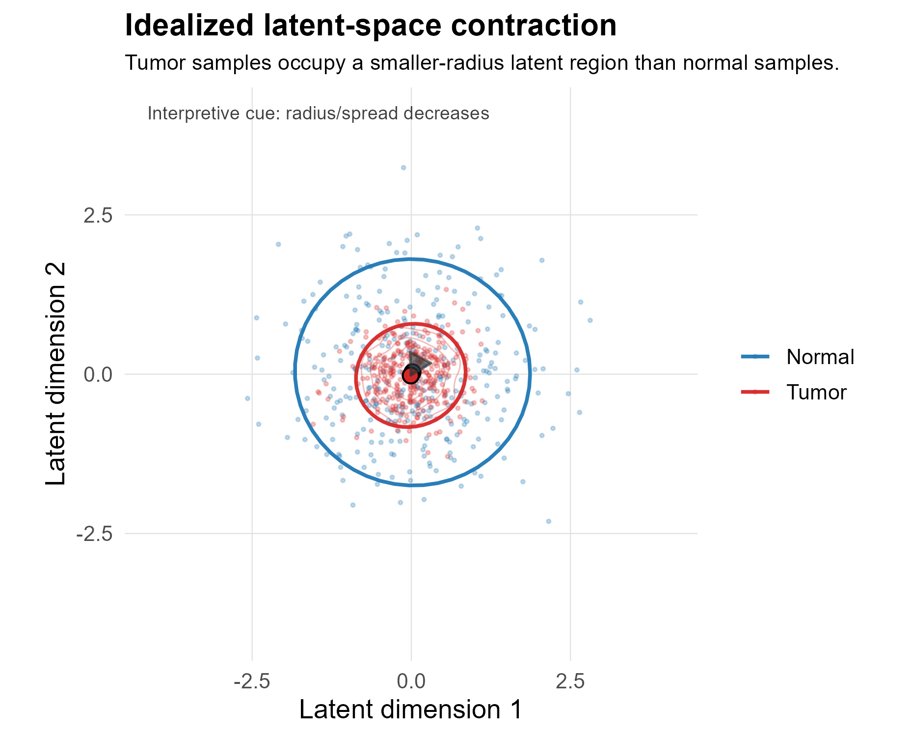

This chapter extends the statistical framework introduced in the preceding complexity and entropy chapter into a geometric representation of transcriptomic variation. The previous chapter defined matrix- and spectrum-based measures of transcriptomic organization. Here, the same logic is carried forward into lower-dimensional sample spaces, first through principal component analysis (PCA) and then through a nonlinear variational autoencoder (VAE) latent representation.

The conceptual progression is:

1. expression matrix structure,
2. linear PCA geometry,
3. nonlinear VAE latent geometry,
4. normal-to-tumor changes in dispersion, dimensionality, anisotropy, neighborhood structure, and centroid position.

The purpose of this chapter is methodological. It defines how latent representations are constructed and how geometric properties of normal and tumor sample distributions are quantified. Biological interpretation is deferred to the results and discussion chapters.

::: {.callout-note}
The latent-space measures are geometric summaries of learned sample representations. They should not be interpreted as direct dynamical quantities unless supported by time-series, perturbation, lineage, or trajectory data.
:::

---

## From Expression-Space Statistics to Latent-Space Geometry

Let the preprocessed expression matrix be denoted as:

$$
X \in \mathbb{R}^{n \times p}
$$

where $n$ is the number of samples and $p$ is the number of selected probes or genes. In the complexity and entropy framework, the central statistical object is the covariance or singular-value structure of $X$. In the latent-space framework, the goal is to construct a lower-dimensional representation:

$$
Z \in \mathbb{R}^{n \times d}
$$

where each sample $i$ is represented by a latent vector:

$$
z_i \in \mathbb{R}^{d}
$$

The resulting latent vectors are then analyzed using the same structural vocabulary introduced previously: dimensionality, dispersion, entropy, anisotropy, and normal-to-tumor change.

For every metric $M$, the direction convention remains:

$$
\Delta M = M_{tumor} - M_{normal}
$$

Positive values indicate that the metric is larger in tumor than in matched normal tissue; negative values indicate that the metric is smaller in tumor than in matched normal tissue.

---

## PCA as a Linear Latent Representation

PCA provides the linear bridge between the covariance-based framework and the nonlinear VAE latent-space analysis. It projects samples onto orthogonal directions of maximal variance and therefore makes the eigenvalue logic of the preceding chapter visible as a sample-space geometry.

After centering the expression matrix, PCA estimates principal directions from the covariance matrix:

$$
\Sigma = \frac{1}{n - 1} X^{T}X
$$

The projection onto the first $d$ principal components is:

$$
Z_{PCA} = XW_d
$$

where $W_d$ contains the first $d$ eigenvectors of $\Sigma$.

This representation is not used as the final latent model, but it is methodologically important because it shows how variance structure in expression space appears as geometry in a lower-dimensional sample projection. Broad dispersion, contraction, clustering, and axis dominance in PCA space correspond directly to the distribution of variance across principal directions.

```{r}
#| label: fig-pca-hu35ksuba
#| echo: false
#| fig-cap: "PCA projection of the hu35ksuba expression matrix using the top 3000 high-variance probes. PCA provides a linear bridge between covariance/eigenvalue statistics and the nonlinear VAE latent-space analysis."

```

The PCA projection should be read as an intermediate representation. It is more than a quality-control plot, but less than the final model. It demonstrates how high-variance expression features organize samples in a linear state space before the analysis moves to a learned nonlinear latent space.

::: {.callout-important}
PCA is a useful linear reference model, but it is constrained to orthogonal linear axes. It does not capture all nonlinear dependencies that may be present in gene-expression data.
:::

---

## Nonlinear Latent Representation Using a Variational Autoencoder

The VAE extends the PCA logic by learning a nonlinear compressed representation of expression profiles. Instead of projecting samples onto fixed linear axes, the encoder learns a mapping from expression space into a lower-dimensional latent space:

$$
x_i \rightarrow z_i
$$

where $x_i$ is the expression vector for sample $i$ and $z_i$ is its latent representation.

In simplified form, the encoder defines an approximate posterior distribution:

$$
q_{\phi}(z \mid x)
$$

and the decoder reconstructs the original expression profile from the latent representation:

$$
p_{\theta}(x \mid z)
$$

The training objective balances reconstruction accuracy with regularization of the latent distribution. In standard VAE form, the loss contains a reconstruction term and a Kullback-Leibler divergence term:

$$
\mathcal{L} = \mathcal{L}_{recon} + \beta D_{KL}\left(q_{\phi}(z \mid x) \Vert p(z)\right)
$$

where $\beta$ controls the strength of latent-space regularization when a weighted formulation is used.

In this project, the VAE is used as a representation-learning method. The downstream biological and statistical analysis is performed on the learned latent coordinates rather than on the neural-network parameters themselves.

---

## VAE Training Diagnostics

The following diagnostics verify that the VAE training procedure produces a stable and non-degenerate latent representation suitable for downstream geometric analysis.

These figures summarize the training dynamics of the variational autoencoder (VAE) used to construct the latent representation of gene expression profiles.

#### Total Loss Trajectory


The total loss is defined as the sum of the reconstruction loss and the Kullback–Leibler (KL) divergence:

$$
\mathcal{L} = \mathcal{L}_{\text{recon}} + \beta \, \mathcal{L}_{\text{KL}}
$$

where:
- $\mathcal{L}_{\text{recon}}$ measures the fidelity of reconstruction of the input expression profiles,
- $\mathcal{L}_{\text{KL}}$ regularizes the latent space toward a standard normal prior,
- $\beta$ controls the strength of regularization (set to 0.01 unless otherwise noted).

The training curve shows a steady decrease in total loss over epochs, with validation loss stabilizing after an initial decline. The divergence between training and validation loss at later epochs suggests mild overfitting, though not severe enough to destabilize the latent representation.

---

#### Decomposition of Loss Components


The loss is decomposed into reconstruction and KL components for both training and validation sets.

Key observations:

- **Reconstruction loss** decreases monotonically during training, indicating improved fidelity of input reconstruction.
- The **KL divergence** increases during training but remains weakly weighted (β = 0.01). This indicates that the latent variables are utilized, while regularization toward the prior remains modest. As a result, the model prioritizes reconstruction fidelity, and the learned latent space is only partially constrained toward a standard normal distribution.
- The increase in KL divergence alongside decreasing reconstruction error indicates that the model is utilizing the latent variables rather than collapsing to a trivial solution.

This behavior is consistent with a non-degenerate latent representation, in which the encoder does not ignore the latent variables.

---

#### Distribution of Latent Coordinates


The distribution of latent variables across all samples is shown above.

Under ideal VAE behavior, latent coordinates should approximate a standard normal distribution. The observed distribution is approximately centered and continuous, though not perfectly Gaussian, reflecting:

- finite sample effects,
- deviations induced by structured biological variation,
- and the absence of explicit β-annealing or stronger regularization.

---

#### Training Parameters

All model hyperparameters were defined in the centralized configuration module (`latent_config.py`) and used consistently throughout training.

- Latent dimension: 10  
- Number of epochs: 50  
- Batch size: 32  
- Learning rate: 1 × 10⁻³  
- β (KL weight): 0.01  
- Train/validation/test split:
  - 70% training
  - 15% validation
  - 15% test  

Feature selection and preprocessing:

- Probe selection method: variance-based  
- Number of features retained: 3000  
- Random seed: 42  

Optimization:

- Optimizer: Adam  
- Loss function: reconstruction (MSE) + β-weighted KL divergence  

No explicit KL annealing or early stopping criterion was applied in this initial model.

---

#### Interpretation

These diagnostics indicate that the VAE converges to a stable solution with:

- decreasing reconstruction error,
- increasing but controlled KL divergence,
- and a broadly regularized latent space.

This provides a suitable basis for downstream latent-space analysis, including assessment of structural complexity, separability, and geometric organization across cancer types.
---

## Latent Representation Pipeline

The latent representation is produced through the following stages:

1. preprocessing and normalization using the R pipeline,
2. high-variance probe selection,
3. VAE model training in Python/PyTorch,
4. latent embedding extraction to `latent.npy`,
5. metadata alignment to `metadata_aligned.csv`,
6. downstream geometric analysis in the latent coordinate system.

After alignment, the working dataset can be written as:

$$
\mathcal{D} = \{(z_i, y_i, c_i)\}_{i=1}^{n}
$$

where $z_i$ is the latent vector for sample $i$, $y_i$ denotes condition, and $c_i$ denotes tissue or cancer class. In this project:

$$
y_i \in \{normal, tumor\}
$$

and $c_i$ identifies the tissue-specific comparison used in downstream analysis.

---

## Idealized Latent-Space Transformations

The figures below are idealized schematics. They are included to clarify the geometric language used in the latent-space analysis. They are not empirical results from the cancer dataset.

```{r}
#| label: fig-idealized-latent-expansion
#| echo: false
#| fig-cap: "Idealized latent-space expansion: tumor samples occupy a larger-radius latent region than normal samples."

```

```{r}
#| label: fig-idealized-latent-contraction
#| echo: false
#| fig-cap: "Idealized latent-space contraction: tumor samples occupy a smaller-radius latent region than normal samples."

```

These latent-space schematics complement, but do not replace, the complexity and entropy schematics introduced in the previous chapter. Expansion and contraction describe the size of the occupied region in latent space. Complexity and entropy describe how variation is distributed within that region.

This distinction is important. A tumor cloud can expand without becoming higher-dimensional, and it can contract while still becoming more anisotropic. Therefore, radius, participation ratio, entropy, and leading-eigenvalue dominance must be interpreted together.

| Geometric pattern | Primary latent signature | Related statistical interpretation |
|---|---|---|
| Latent expansion | Increased radius or dispersion | Tumor samples occupy a larger region of latent space. |
| Latent contraction | Decreased radius or dispersion | Tumor samples occupy a smaller region of latent space. |
| Dimensionality gain | Increased participation ratio or effective rank | Variation is distributed across more latent directions. |
| Dimensionality loss | Decreased participation ratio or effective rank | Variation collapses toward fewer latent directions. |
| Increased anisotropy | Increased leading-eigenvalue fraction | One direction dominates latent variation. |
| Decreased anisotropy | Decreased leading-eigenvalue fraction | Latent variance is more evenly distributed. |

---

## Latent Geometry Measures

For each class or condition-specific group, let:

$$
X_c = \{z_i : c_i = c\}
$$

where $X_c$ is the set of latent vectors belonging to group $c$. If there are $n_c$ samples in group $c$, the group centroid is:

$$
\mu_c = \frac{1}{n_c} \sum_{i \in c} z_i
$$

The covariance matrix of the latent vectors is:

$$
\Sigma_c = \mathrm{cov}(X_c)
$$

Let the eigenvalues of $\Sigma_c$ be ordered as:

$$
\lambda_1 \geq \lambda_2 \geq \cdots \geq \lambda_d \geq 0
$$

These eigenvalues define the group-level latent geometry.

---

### Participation Ratio

The participation ratio estimates the effective number of latent dimensions contributing to variation:

$$
PR_c = \frac{\left(\sum_i \lambda_i\right)^2}{\sum_i \lambda_i^2}
$$

Higher values indicate that variance is distributed across more latent dimensions. Lower values indicate concentration into fewer directions.

---

### Eigenvalue Entropy

First define normalized eigenvalues:

$$
p_i = \frac{\lambda_i}{\sum_j \lambda_j}
$$

The latent eigenvalue entropy is:

$$
H_c = -\sum_i p_i \log(p_i)
$$

Higher values indicate a more even variance distribution across latent dimensions. Lower values indicate stronger dominance by one or a few latent directions.

---

### Effective Rank

The effective rank is the exponential of eigenvalue entropy:

$$
effrank_c = \exp(H_c)
$$

It can be interpreted as an entropy-based estimate of the number of effective latent dimensions.

---

### Anisotropy

Anisotropy is measured as the fraction of variance explained by the leading eigenvalue:

$$
A_c = \frac{\lambda_1}{\sum_i \lambda_i}
$$

Higher values indicate greater dominance by the first latent direction. Lower values indicate a more isotropic or evenly distributed covariance structure.

---

### Radius and Dispersion

The average radius of group $c$ is defined as the mean distance from each sample to the group centroid:

$$
R_c = \frac{1}{n_c} \sum_{i \in c} \lVert z_i - \mu_c \rVert
$$

This measures the overall size of the occupied latent region. It is related to dispersion, but it is not identical to dimensionality. A cloud may have a large radius because it expands along one axis, or because it expands across many dimensions.

---

### Centroid Distance

For normal and tumor groups within the same tissue comparison, centroid distance is defined as:

$$
D_{N,T} = \lVert \mu_T - \mu_N \rVert
$$

This measures global displacement between the normal and tumor latent states. It should be interpreted as a geometric separation measure, not as a direct measure of complexity or entropy.

---

### Local Neighborhood Structure

Covariance-based measures describe global shape. Local neighborhood measures describe whether samples are locally mixed or locally segregated.

Using $k$-nearest neighbors, the same-group neighbor fraction for sample $i$ can be written as:

$$
S_i = \frac{1}{k} \sum_{j \in N_k(i)} I(y_j = y_i)
$$

where $N_k(i)$ is the set of $k$ nearest neighbors of sample $i$, and $I(y_j = y_i)$ is an indicator equal to 1 when neighbor $j$ has the same group label as sample $i$.

High same-group neighbor fractions indicate local segregation. Low values indicate local mixing between normal and tumor samples.

---

## Normal-to-Tumor Latent Change

For each tissue-specific comparison $t$, matched normal and tumor latent vectors are defined as:

$$
X_t^{(N)} = \{z_i : y_i = normal, c_i = t\}
$$

and:

$$
X_t^{(T)} = \{z_i : y_i = tumor, c_i = t\}
$$

For each latent metric $M$, the normal-to-tumor change is:

$$
\Delta M_t = M_t^{(T)} - M_t^{(N)}
$$

The main latent-space outputs include:

| Metric | Change statistic | Interpretation |
|---|---|---|
| Participation ratio | $\Delta PR$ | Change in effective latent dimensionality. |
| Eigenvalue entropy | $\Delta H$ | Change in evenness of latent variance distribution. |
| Effective rank | $\Delta effrank$ | Entropy-based change in effective dimensionality. |
| Anisotropy | $\Delta A$ | Change in leading-direction dominance. |
| Radius | $\Delta R$ | Expansion or contraction of latent dispersion. |
| Centroid distance | $D_{N,T}$ | Displacement between normal and tumor latent centroids. |
| Same-group neighbor fraction | $\Delta S$ or group-specific $S$ | Local separation or mixing of sample neighborhoods. |

---

## Relationship to Complexity and Entropy Measures

The latent-space analysis is designed to be read together with the previous complexity and entropy chapter. Both chapters use the same general mathematical vocabulary, but they apply it to different representations.

| Analysis level | Data object | Main question | Typical measures |
|---|---|---|---|
| Expression-space complexity and entropy | Probe or gene expression matrix $X$ | How does transcriptomic structure change from normal to tumor? | Condition number, effective rank, participation ratio, spectral entropy, Shannon entropy. |
| PCA geometry | Linear projection $Z_{PCA}$ | How does expression variance appear in a low-dimensional linear sample space? | PC spread, visual separation, axis dominance. |
| VAE latent geometry | Learned nonlinear latent matrix $Z$ | How do normal and tumor samples occupy learned state space? | Radius, centroid distance, latent participation ratio, latent entropy, anisotropy, neighborhood structure. |

The important continuity is that all three levels describe organization of sample variation. The important difference is that PCA and VAE analyses operate on sample coordinates, whereas the original complexity and entropy analysis operates directly on expression matrices and their spectra.

::: {.callout-warning}
Latent-space separation is not automatically equivalent to biological complexity. A strong centroid shift may indicate classification-relevant separation without implying increased entropy or higher effective dimensionality. Conversely, a tumor group may become more diffuse without becoming more separable from normal tissue.
:::

---

## Practical Interpretation Rules

The following rules guide conservative interpretation of latent-space results:

1. Interpret radius changes as expansion or contraction of the occupied latent region, not as dimensionality changes by themselves.
2. Interpret participation ratio, effective rank, and eigenvalue entropy as evidence about latent dimensionality and spectral evenness.
3. Interpret anisotropy as dominance by one or a few latent directions.
4. Interpret centroid distance as displacement between normal and tumor states, not as a direct complexity measure.
5. Use local neighborhood measures to distinguish global overlap from local mixing.
6. Compare latent-space patterns with expression-space complexity and entropy metrics before making biological claims.
7. Treat PCA as a linear reference geometry and the VAE as a learned nonlinear representation.

---

## Summary

This chapter establishes a geometric extension of the complexity and entropy framework. PCA provides the linear bridge from covariance structure to low-dimensional sample geometry. The VAE then generalizes this logic to a nonlinear learned latent space. Within that latent space, normal and tumor groups are compared using measures of dimensionality, entropy, anisotropy, dispersion, centroid displacement, and neighborhood structure.

Read together, the complexity/entropy and latent-space chapters provide a unified statistical language for describing malignant transformation as a change in transcriptomic state-space organization.
